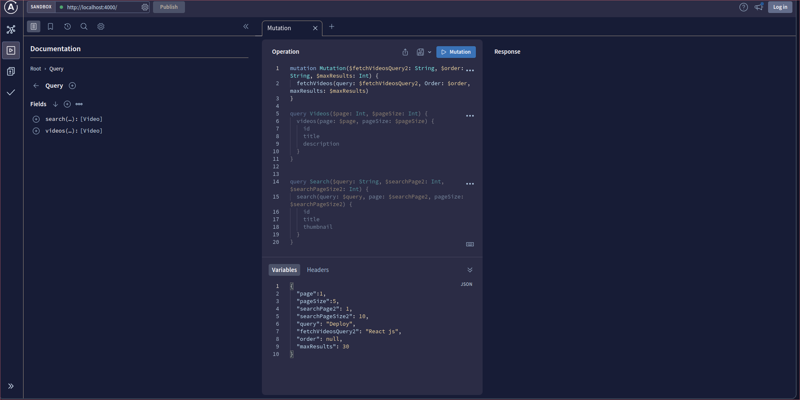

# YouTube GraphQl API

To start the server you need to first install all the dependencies with
```
npm install
```
after that you can start the server with
```
npm start
```

When you open the url you will see the dashboard as shown in the following image:



### Prisma dashboard

You can also run prisma dashboard to manage the database

```
npx prisma studio
```

